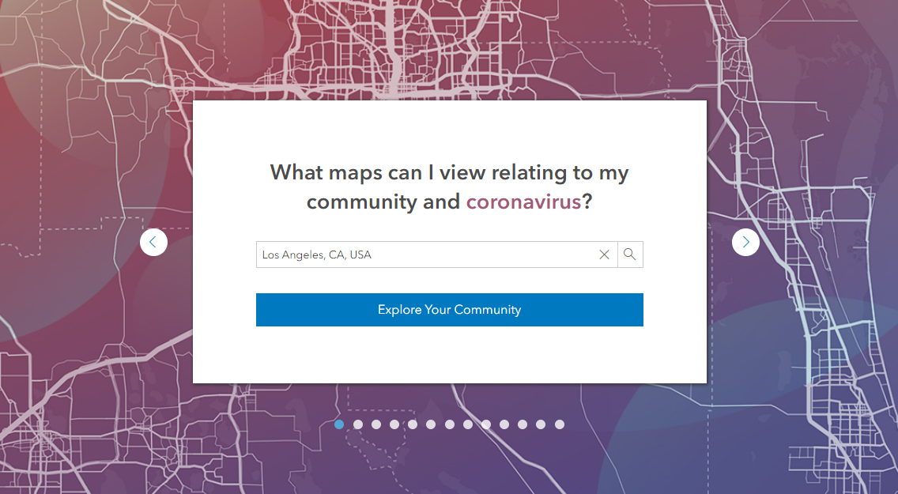

# Esri Maps for Public Policy Site

Esri’s Public Policy site gives you instant access to hundreds of policy maps that reveal important facts about your community.

At [this site](esri.com/policymaps), you can explore issues, such as housing, healthcare, or education, across the country or just in your community.  Build a map collection, and easily share it with stakeholders to inform policy decisions.

## Resources
- [Explore, Collect, and Share Maps About Issues Important to Your Community](https://www.esri.com/arcgis-blog/products/arcgis-living-atlas/local-government/explore-collect-and-share-maps-about-issues-important-to-your-community/)
- [Top 10 Tips for Policy Mapping](https://www.esri.com/arcgis-blog/products/arcgis-living-atlas/mapping/top-10-tips-for-policy-mapping/)
- [ArcGIS Living Atlas of the World](https://livingatlas.arcgis.com/en/)

## Issues

Find a bug or want to request a new feature?  Please let us know by submitting an issue.

## Licensing
Copyright 2020 Esri

Licensed under the Apache License, Version 2.0 (the "License");
you may not use this file except in compliance with the License.
You may obtain a copy of the License at

   http://www.apache.org/licenses/LICENSE-2.0

Unless required by applicable law or agreed to in writing, software
distributed under the License is distributed on an "AS IS" BASIS,
WITHOUT WARRANTIES OR CONDITIONS OF ANY KIND, either express or implied.
See the License for the specific language governing permissions and
limitations under the License.

A copy of the license is available in the repository's [license.txt](license.txt) file.